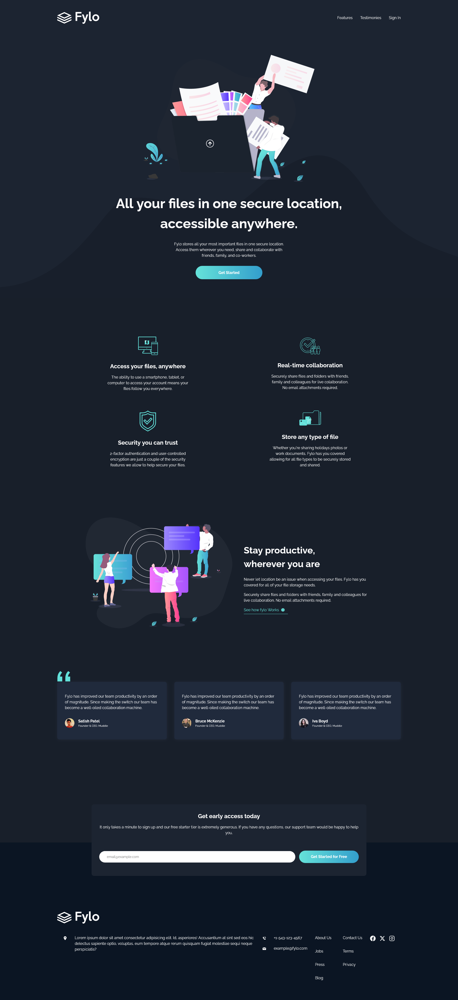

# Fylo

This is a solution to the [Fylo landing page challenge on Frontend Mentor](https://www.frontendmentor.io/challenges/fylo-dark-theme-landing-page-5ca5f2d21e82137ec91a50fd).
## Table of contents

- [Overview](#overview)
  - [The challenge](#the-challenge)
  - [Screenshot](#screenshot)
- [My process](#my-process)
  - [Built with](#built-with)
  - [Useful resources](#useful-resources)
- [Author](#author)

## Overview
 - This project is a landing page for Fylo, is a website that offers file storing-related services.
 - A tiny bit of modifications were made to the website to match the ideas that I had in mind while creating the website.
 
### The challenge

Users should be able to:

- View the optimal layout for the site depending on their device's screen size
- See hover states for all interactive elements on the page

### Screenshot

## My process
 - I started with the barebones of the site before adding the styling. Once The mobile view of the website was done, I then started finishing the desktop layout, after that was the
 implementation of basic routing followed by the implementation of mobile nav.
### Built with

- Semantic HTML5 markup
- CSS custom properties
- Flexbox
- CSS Grid
- Mobile-first workflow
- [React](https://reactjs.org/)
- [SASS](https://sass-lang.com/guide/)

### Useful resources

- [mdn for css](https://developer.mozilla.org/en-US/docs/Web/CSS) - Helped me verify syntaxes that either I don't know or remember clearly.
- [w3Schools](https://www.w3schools.com/css/) - Similar purpose to mdn.
- [chatgpt], [stackoverflow] - Used to get ideas.

## Author

- Website - TBA
- Frontend Mentor - [@rttn-Mango](https://www.frontendmentor.io/profile/rttn-Mango)
